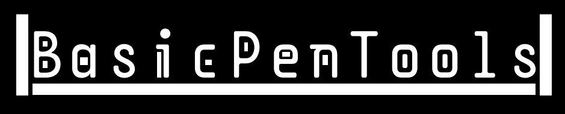

<p align="center">
  
</p>

*BasicPenTools is made for Linux only*

# What Is BasicPenTools?
A simpler way to use pentesting tools! BasicPenTools is a group of commands that takes things like NMAP, aircrack-ng, and more all into simpler and faster commands to use!
This is a great repo for newer pentesters to learn how things actually work not be thrown into complicated terminal commands immediately. Feel free to leave your thoughts, comments, or suggestions!

Being a pentester of Kali for a few years, I've taken more liking to tools such as wifite which are much simpler and user friendly with actual english explaining simply how to use the tools provided, making accessibility much easier. Having both a colorful and consise user interface is preferred to many then simple text. Not only that but it allows no room for error when it comes to syntax, BasicPenTools give a much more direct userinterface with automatic error detection and explanation!

# Requirements

## Arch
Installed the Blackarch repo from here
```
https://github.com/BlackArch/blackarch-installer
```
And the insall script will work. (Going to modify install.sh to make this automatic)

## Other Depos
Just run install.sh!
(Will update later for more specific requirements for other distros, please comment if your distro doesn't work!)

# How To Install

Run the following commands to install BasicPenTools:

```
git clone https://github.com/PreebyBeeby/BasicPenTools
cd BasicPenTools
chmod +x install.sh
sudo ./install.sh
cd ..
```

The install script should do everything automatically, if not tell me!

After installing, run 
```
pentools -h
```
or
```
pentools --help
```

to understand how to use it!
